# MVVM Expliqué en Détail avec Diagrammes

## Table des matières

1. [Introduction au pattern MVVM](#introduction-au-pattern-mvvm)
2. [Architecture en couches](#architecture-en-couches)
3. [Flux de données](#flux-de-données)
4. [Data Binding](#data-binding)
5. [Diagrammes de séquence](#diagrammes-de-séquence)
6. [Implémentation dans ce projet](#implémentation-dans-ce-projet)
7. [Comparaisons](#comparaisons)

---

## Introduction au pattern MVVM

**MVVM** (Model-View-ViewModel) est un pattern architectural qui sépare la logique métier, la logique de présentation et l'interface utilisateur. Il repose sur le principe du **data binding bidirectionnel** pour synchroniser automatiquement les données entre les couches.

### Origine et contexte

- Créé par Microsoft pour WPF (Windows Presentation Foundation)
- Optimisé pour les frameworks avec data binding
- Évolution du pattern MVC adapté aux interfaces modernes

---

## Architecture en couches

### Vue d'ensemble

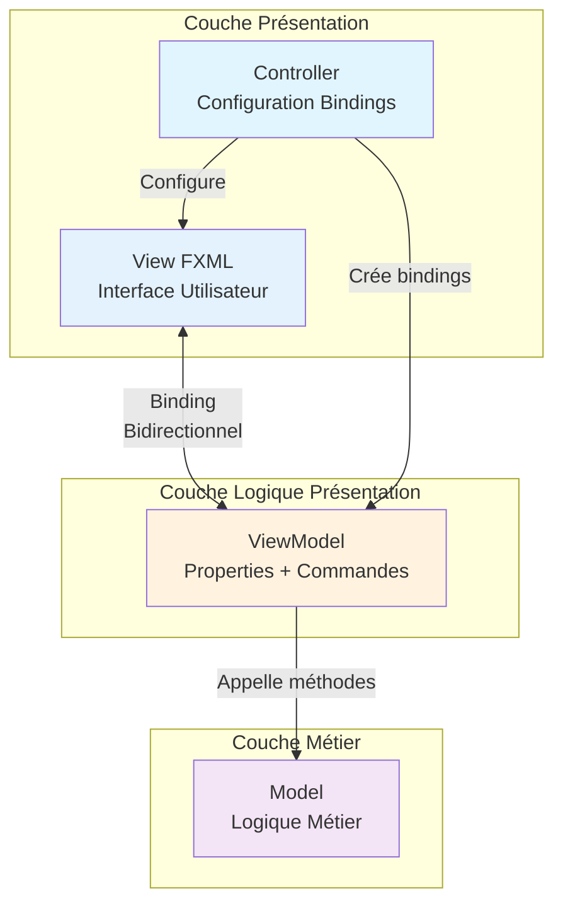
```mermaid
graph TB
    subgraph "Couche Présentation"
        V[View FXML<br/>Interface Utilisateur]
        C[Controller<br/>Configuration Bindings]
    end
    
    subgraph "Couche Logique Présentation"
        VM[ViewModel<br/>Properties + Commandes]
    end
    
    subgraph "Couche Métier"
        M[Model<br/>Logique Métier]
    end
    
    V <--> |Binding<br/>Bidirectionnel| VM
    C --> |Configure| V
    C --> |Crée bindings| VM
    VM --> |Appelle méthodes| M
    
    style V fill:#e3f2fd
    style C fill:#e1f5fe
    style VM fill:#fff3e0
    style M fill:#f3e5f5
```

### Responsabilités détaillées

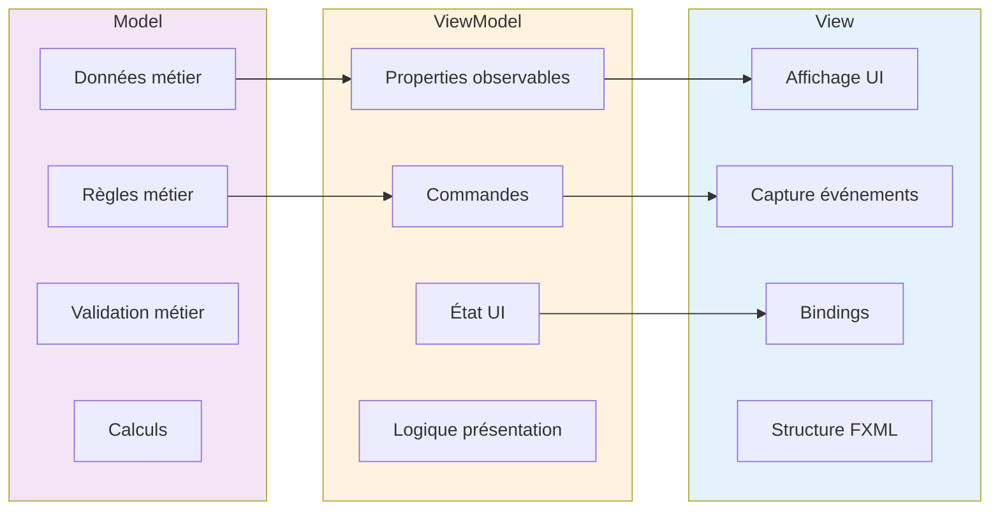
```mermaid
graph LR
    subgraph Model
        M1[Données métier]
        M2[Règles métier]
        M3[Validation métier]
        M4[Calculs]
    end
    
    subgraph ViewModel
        VM1[Properties observables]
        VM2[Commandes]
        VM3[État UI]
        VM4[Logique présentation]
    end
    
    subgraph View
        V1[Affichage UI]
        V2[Capture événements]
        V3[Bindings]
        V4[Structure FXML]
    end
    
    M1 --> VM1
    M2 --> VM2
    VM1 --> V1
    VM2 --> V2
    VM3 --> V3
    
    style Model fill:#f3e5f5
    style ViewModel fill:#fff3e0
    style View fill:#e3f2fd
```

---

## Flux de données

### Flux complet d'une action utilisateur

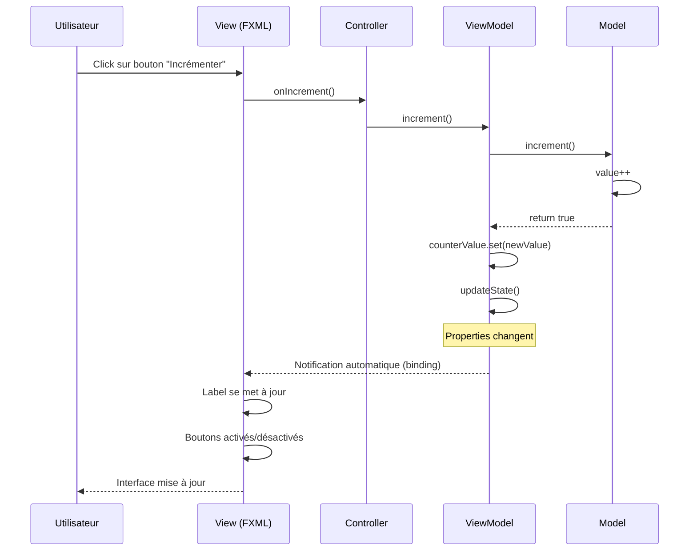
```mermaid
sequenceDiagram
    participant U as Utilisateur
    participant V as View (FXML)
    participant C as Controller
    participant VM as ViewModel
    participant M as Model
    
    U->>V: Click sur bouton "Incrémenter"
    V->>C: onIncrement()
    C->>VM: increment()
    VM->>M: increment()
    M->>M: value++
    M-->>VM: return true
    VM->>VM: counterValue.set(newValue)
    VM->>VM: updateState()
    Note over VM: Properties changent
    VM-->>V: Notification automatique (binding)
    V->>V: Label se met à jour
    V->>V: Boutons activés/désactivés
    V-->>U: Interface mise à jour
```

### Cycle de vie du binding

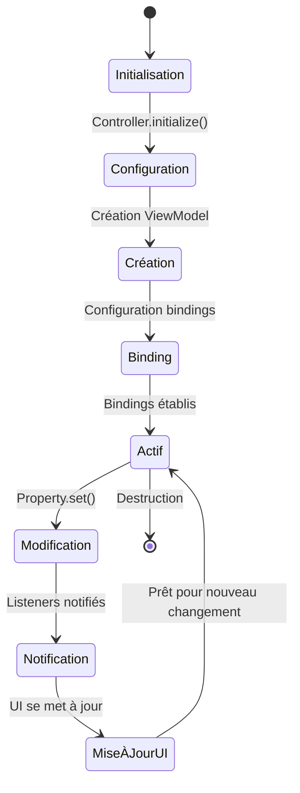
```mermaid
stateDiagram-v2
    [*] --> Initialisation
    Initialisation --> Configuration: Controller.initialize()
    Configuration --> Création: Création ViewModel
    Création --> Binding: Configuration bindings
    Binding --> Actif: Bindings établis
    
    Actif --> Modification: Property.set()
    Modification --> Notification: Listeners notifiés
    Notification --> MiseÀJourUI: UI se met à jour
    MiseÀJourUI --> Actif: Prêt pour nouveau changement
    
    Actif --> [*]: Destruction
```

---

## Data Binding

### Types de binding dans ce projet

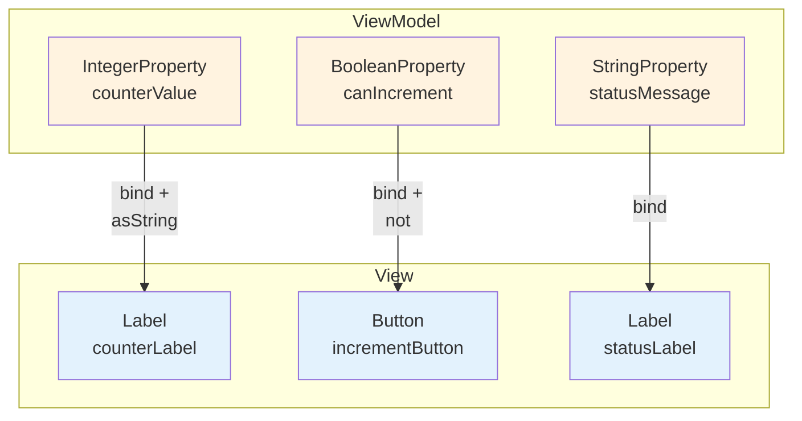
```mermaid
graph TB
    subgraph "ViewModel"
        P1[IntegerProperty<br/>counterValue]
        P2[BooleanProperty<br/>canIncrement]
        P3[StringProperty<br/>statusMessage]
    end
    
    subgraph "View"
        L1[Label<br/>counterLabel]
        B1[Button<br/>incrementButton]
        L2[Label<br/>statusLabel]
    end
    
    P1 -->|bind +<br/>asString| L1
    P2 -->|bind +<br/>not| B1
    P3 -->|bind| L2
    
    style P1 fill:#fff3e0
    style P2 fill:#fff3e0
    style P3 fill:#fff3e0
    style L1 fill:#e3f2fd
    style B1 fill:#e3f2fd
    style L2 fill:#e3f2fd
```

### Mécanisme du binding

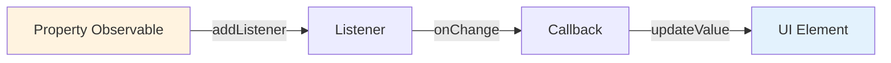
```mermaid
graph LR
    A[Property Observable] -->|addListener| B[Listener]
    B -->|onChange| C[Callback]
    C -->|updateValue| D[UI Element]
    
    style A fill:#fff3e0
    style D fill:#e3f2fd
```

---

## Diagrammes de séquence

### Scénario 1 : Initialisation de l'application

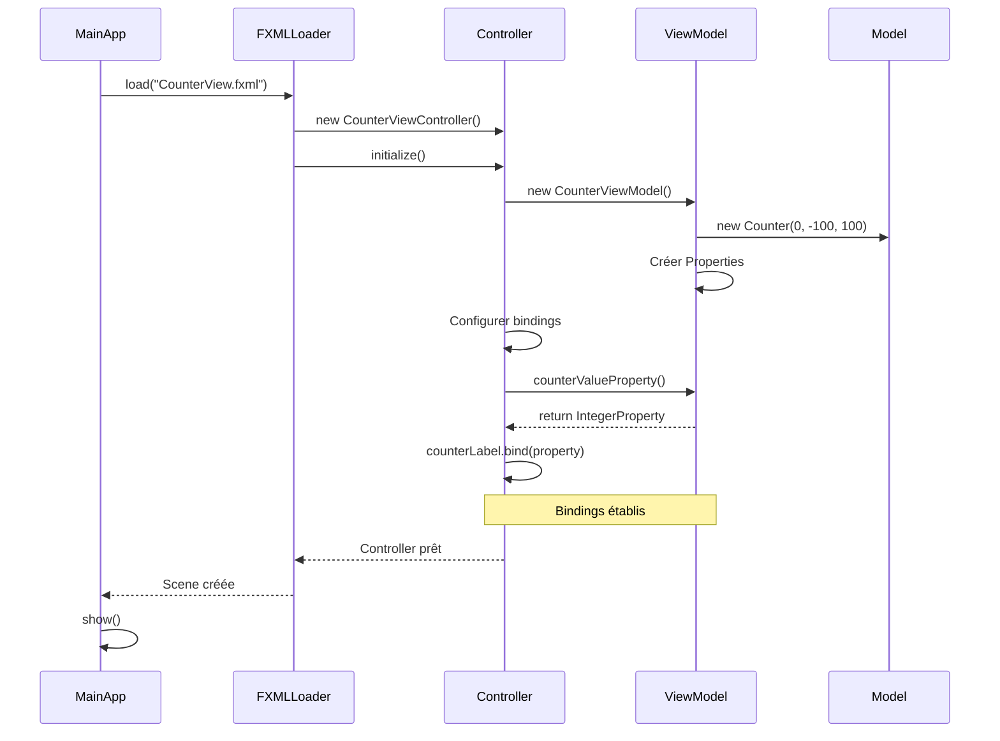
```mermaid
sequenceDiagram
    participant Main as MainApp
    participant Loader as FXMLLoader
    participant C as Controller
    participant VM as ViewModel
    participant M as Model
    
    Main->>Loader: load("CounterView.fxml")
    Loader->>C: new CounterViewController()
    Loader->>C: initialize()
    C->>VM: new CounterViewModel()
    VM->>M: new Counter(0, -100, 100)
    VM->>VM: Créer Properties
    C->>C: Configurer bindings
    C->>VM: counterValueProperty()
    VM-->>C: return IntegerProperty
    C->>C: counterLabel.bind(property)
    Note over C,VM: Bindings établis
    C-->>Loader: Controller prêt
    Loader-->>Main: Scene créée
    Main->>Main: show()
```

### Scénario 2 : Incrémenter le compteur

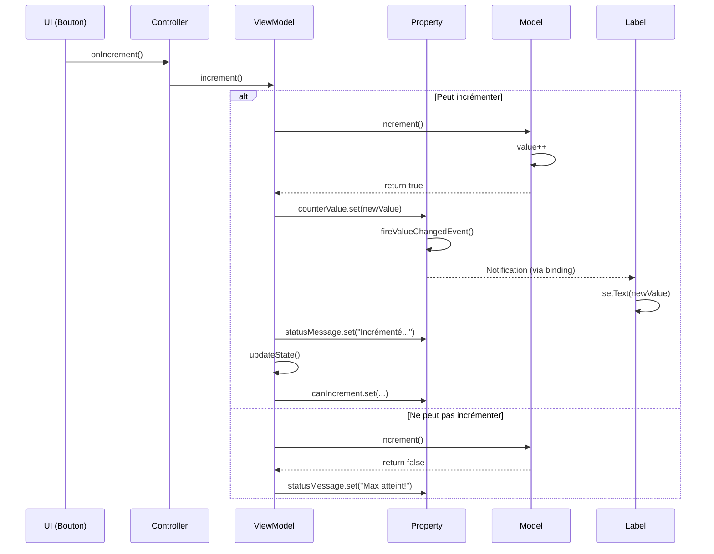
```mermaid
sequenceDiagram
    participant U as UI (Bouton)
    participant C as Controller
    participant VM as ViewModel
    participant P as Property
    participant M as Model
    participant L as Label
    
    U->>C: onIncrement()
    C->>VM: increment()
    
    alt Peut incrémenter
        VM->>M: increment()
        M->>M: value++
        M-->>VM: return true
        VM->>P: counterValue.set(newValue)
        P->>P: fireValueChangedEvent()
        P-->>L: Notification (via binding)
        L->>L: setText(newValue)
        VM->>P: statusMessage.set("Incrémenté...")
        VM->>VM: updateState()
        VM->>P: canIncrement.set(...)
    else Ne peut pas incrémenter
        VM->>M: increment()
        M-->>VM: return false
        VM->>P: statusMessage.set("Max atteint!")
    end
```

### Scénario 3 : Désactivation automatique du bouton

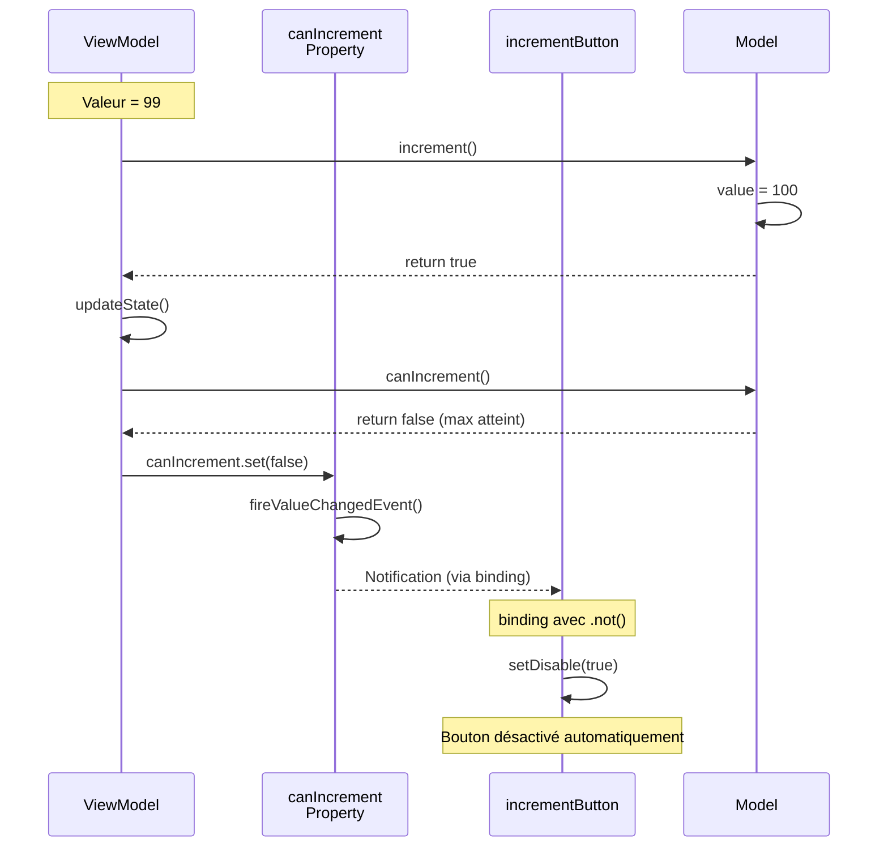
```mermaid
sequenceDiagram
    participant VM as ViewModel
    participant P1 as canIncrement<br/>Property
    participant B as incrementButton
    participant M as Model
    
    Note over VM: Valeur = 99
    VM->>M: increment()
    M->>M: value = 100
    M-->>VM: return true
    VM->>VM: updateState()
    VM->>M: canIncrement()
    M-->>VM: return false (max atteint)
    VM->>P1: canIncrement.set(false)
    P1->>P1: fireValueChangedEvent()
    P1-->>B: Notification (via binding)
    Note over B: binding avec .not()
    B->>B: setDisable(true)
    Note over B: Bouton désactivé automatiquement
```

---

## Implémentation dans ce projet

### Architecture globale du projet

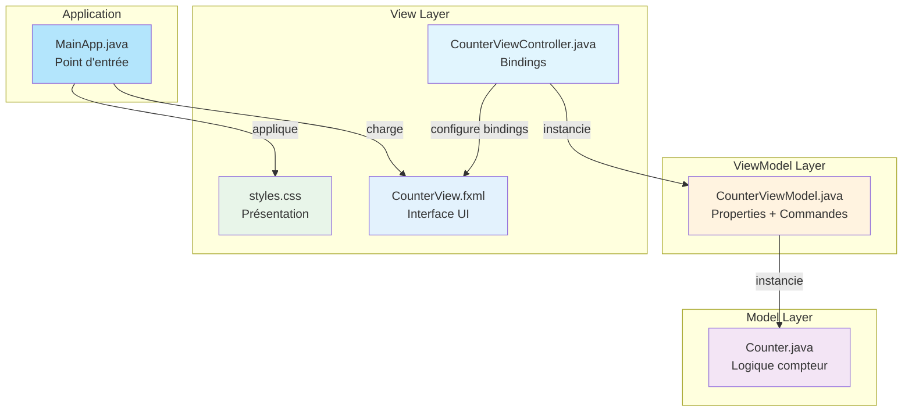
```mermaid
graph TB
    subgraph "Application"
        MA[MainApp.java<br/>Point d'entrée]
    end
    
    subgraph "Model Layer"
        CO[Counter.java<br/>Logique compteur]
    end
    
    subgraph "ViewModel Layer"
        CVM[CounterViewModel.java<br/>Properties + Commandes]
    end
    
    subgraph "View Layer"
        FXML[CounterView.fxml<br/>Interface UI]
        CTRL[CounterViewController.java<br/>Bindings]
        CSS[styles.css<br/>Présentation]
    end
    
    MA -->|charge| FXML
    MA -->|applique| CSS
    CTRL -->|instancie| CVM
    CVM -->|instancie| CO
    CTRL -->|configure bindings| FXML
    
    style MA fill:#b3e5fc
    style CO fill:#f3e5f5
    style CVM fill:#fff3e0
    style FXML fill:#e3f2fd
    style CTRL fill:#e1f5fe
    style CSS fill:#e8f5e9
```

### Diagramme de classes

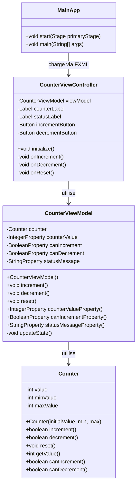
```mermaid
classDiagram
    class Counter {
        -int value
        -int minValue
        -int maxValue
        +Counter(initialValue, min, max)
        +boolean increment()
        +boolean decrement()
        +void reset()
        +int getValue()
        +boolean canIncrement()
        +boolean canDecrement()
    }
    
    class CounterViewModel {
        -Counter counter
        -IntegerProperty counterValue
        -BooleanProperty canIncrement
        -BooleanProperty canDecrement
        -StringProperty statusMessage
        +CounterViewModel()
        +void increment()
        +void decrement()
        +void reset()
        +IntegerProperty counterValueProperty()
        +BooleanProperty canIncrementProperty()
        +StringProperty statusMessageProperty()
        -void updateState()
    }
    
    class CounterViewController {
        -CounterViewModel viewModel
        -Label counterLabel
        -Label statusLabel
        -Button incrementButton
        -Button decrementButton
        +void initialize()
        -void onIncrement()
        -void onDecrement()
        -void onReset()
    }
    
    class MainApp {
        +void start(Stage primaryStage)
        +void main(String[] args)
    }
    
    CounterViewModel --> Counter : utilise
    CounterViewController --> CounterViewModel : utilise
    MainApp --> CounterViewController : charge via FXML
```

### Relations entre les classes

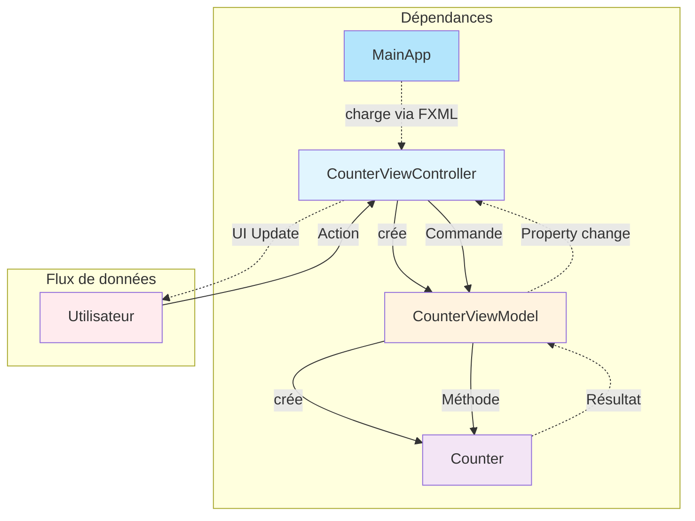
```mermaid
graph TD
    subgraph "Dépendances"
        MA[MainApp] -.->|charge via FXML| CVC[CounterViewController]
        CVC -->|crée| CVM[CounterViewModel]
        CVM -->|crée| C[Counter]
    end
    
    subgraph "Flux de données"
        USER[Utilisateur] -->|Action| CVC
        CVC -->|Commande| CVM
        CVM -->|Méthode| C
        C -.->|Résultat| CVM
        CVM -.->|Property change| CVC
        CVC -.->|UI Update| USER
    end
    
    style MA fill:#b3e5fc
    style CVC fill:#e1f5fe
    style CVM fill:#fff3e0
    style C fill:#f3e5f5
    style USER fill:#ffebee
```

---

## Properties Observable en détail

### Anatomie d'une Property

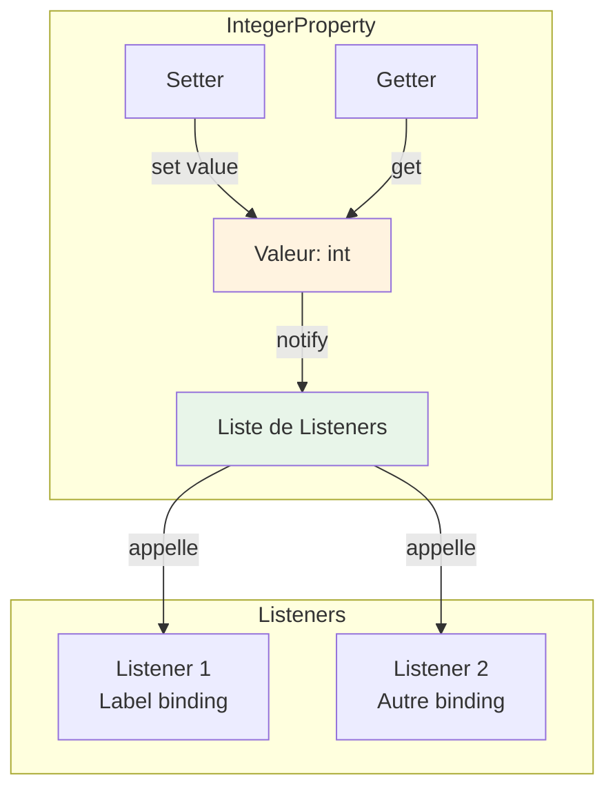
```mermaid
graph TB
    subgraph "IntegerProperty"
        V[Valeur: int]
        L[Liste de Listeners]
        G[Getter]
        S[Setter]
    end
    
    subgraph "Listeners"
        L1[Listener 1<br/>Label binding]
        L2[Listener 2<br/>Autre binding]
    end
    
    S -->|set value| V
    V -->|notify| L
    L -->|appelle| L1
    L -->|appelle| L2
    G -->|get| V
    
    style V fill:#fff3e0
    style L fill:#e8f5e9
```

### Chaîne de binding

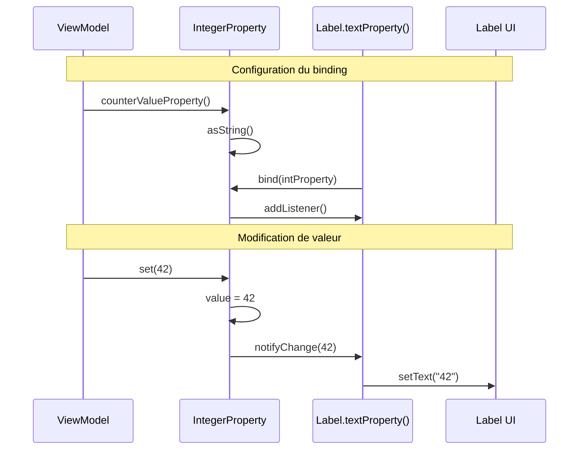
```mermaid
sequenceDiagram
    participant VM as ViewModel
    participant IP as IntegerProperty
    participant LP as Label.textProperty()
    participant L as Label UI
    
    Note over VM,L: Configuration du binding
    VM->>IP: counterValueProperty()
    IP->>IP: asString()
    LP->>IP: bind(intProperty)
    IP->>LP: addListener()
    
    Note over VM,L: Modification de valeur
    VM->>IP: set(42)
    IP->>IP: value = 42
    IP->>LP: notifyChange(42)
    LP->>L: setText("42")
```

---

## Comparaisons

### MVVM vs MVC

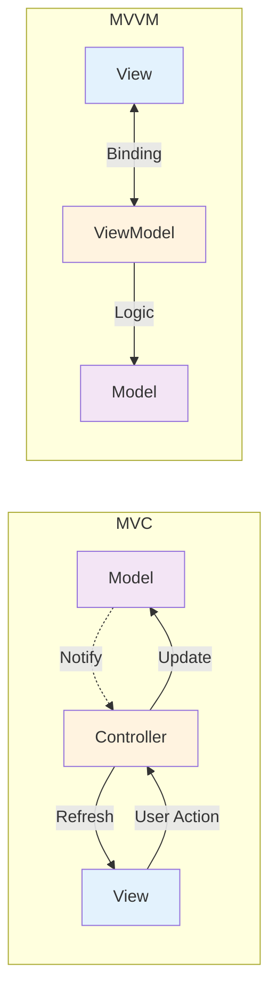
```mermaid
graph LR
    subgraph "MVC"
        M1[Model]
        V1[View]
        C1[Controller]
        
        V1 -->|User Action| C1
        C1 -->|Update| M1
        M1 -.->|Notify| C1
        C1 -->|Refresh| V1
    end
    
    subgraph "MVVM"
        M2[Model]
        VM[ViewModel]
        V2[View]
        
        V2 <-->|Binding| VM
        VM -->|Logic| M2
    end
    
    style M1 fill:#f3e5f5
    style M2 fill:#f3e5f5
    style C1 fill:#fff3e0
    style VM fill:#fff3e0
    style V1 fill:#e3f2fd
    style V2 fill:#e3f2fd
```

### Tableau comparatif

| Aspect | MVC | MVVM |
|--------|-----|------|
| **Communication View-Logic** | Manuelle via Controller | Automatique via Binding |
| **Testabilité** | Controller difficile à tester | ViewModel facilement testable |
| **Couplage** | Vue couplée au Controller | Vue découplée du ViewModel |
| **Synchronisation** | Manuelle (setText, etc.) | Automatique (Properties) |
| **Framework** | Tous | Nécessite data binding |
| **Complexité initiale** | Faible | Moyenne |
| **Maintenabilité** | Moyenne | Élevée |

---

## Avantages et principes clés

### Principes SOLID appliqués

```mermaid
graph TB
    S[Single Responsibility<br/>Une classe = une responsabilité]
    O[Open/Closed<br/>Ouvert extension, fermé modification]
    L[Liskov Substitution<br/>Remplaçabilité]
    I[Interface Segregation<br/>Interfaces spécifiques]
    D[Dependency Inversion<br/>Dépendre d'abstractions]
    
    S --> Model
    S --> ViewModel
    S --> View
    D --> VM2[ViewModel dépend<br/>de Model, pas l'inverse]
    
    style S fill:#e3f2fd
    style O fill:#e3f2fd
    style L fill:#e3f2fd
    style I fill:#e3f2fd
    style D fill=#e3f2fd
```

### Avantages du pattern

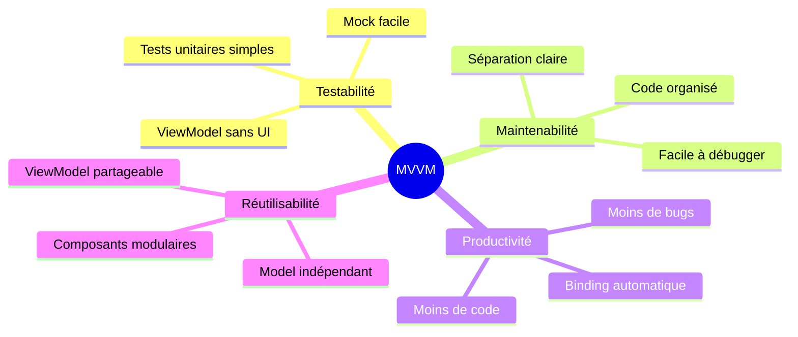
```mermaid
mindmap
  root((MVVM))
    Testabilité
      ViewModel sans UI
      Tests unitaires simples
      Mock facile
    Maintenabilité
      Séparation claire
      Code organisé
      Facile à débugger
    Productivité
      Binding automatique
      Moins de code
      Moins de bugs
    Réutilisabilité
      Model indépendant
      ViewModel partageable
      Composants modulaires
```

---

## Exemple concret : Cycle de vie complet

### De l'action utilisateur à la mise à jour UI

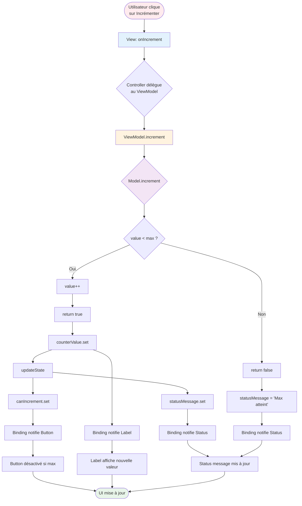
```mermaid
graph TB
    Start([Utilisateur clique<br/>sur Incrémenter])
    
    Start --> A[View: onIncrement]
    A --> B{Controller délègue<br/>au ViewModel}
    B --> C[ViewModel.increment]
    C --> D{Model.increment}
    
    D --> E{value < max ?}
    E -->|Oui| F[value++]
    E -->|Non| G[return false]
    
    F --> H[return true]
    H --> I[counterValue.set]
    I --> J[updateState]
    J --> K[canIncrement.set]
    J --> L[statusMessage.set]
    
    K --> M[Binding notifie Button]
    I --> N[Binding notifie Label]
    L --> O[Binding notifie Status]
    
    M --> P[Button désactivé si max]
    N --> Q[Label affiche nouvelle valeur]
    O --> R[Status message mis à jour]
    
    G --> S[statusMessage = 'Max atteint']
    S --> T[Binding notifie Status]
    T --> R
    
    P --> End([UI mise à jour])
    Q --> End
    R --> End
    
    style Start fill:#ffebee
    style End fill:#e8f5e9
    style D fill:#f3e5f5
    style C fill:#fff3e0
    style A fill:#e3f2fd
```

---

## Patterns complémentaires

### Command Pattern avec MVVM

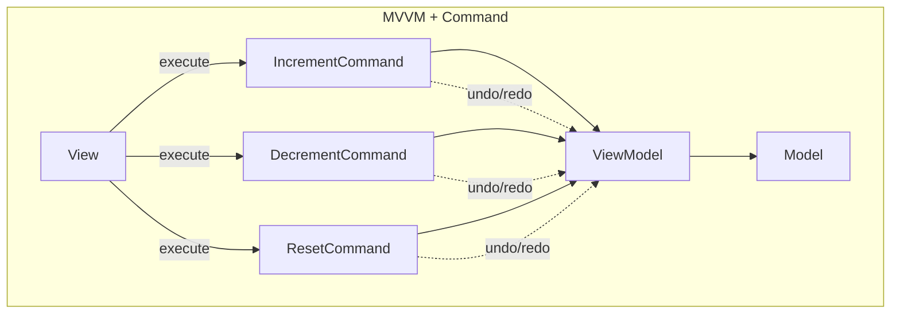
```mermaid
graph TB
    subgraph "MVVM + Command"
        V[View]
        VM[ViewModel]
        C1[IncrementCommand]
        C2[DecrementCommand]
        C3[ResetCommand]
        M[Model]
    end
    
    V -->|execute| C1
    V -->|execute| C2
    V -->|execute| C3
    
    C1 --> VM
    C2 --> VM
    C3 --> VM
    
    VM --> M
    
    C1 -.->|undo/redo| VM
    C2 -.->|undo/redo| VM
    C3 -.->|undo/redo| VM
```

### Observer Pattern (intégré dans Properties)

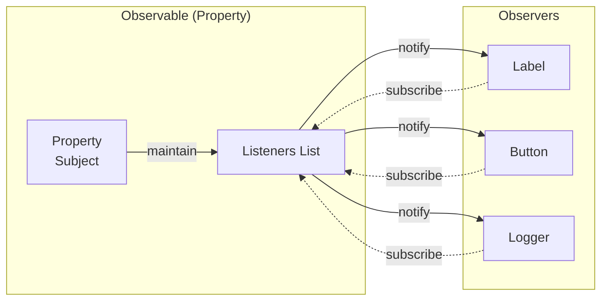
```mermaid
graph LR
    subgraph "Observable (Property)"
        P[Property<br/>Subject]
        L[Listeners List]
    end
    
    subgraph "Observers"
        O1[Label]
        O2[Button]
        O3[Logger]
    end
    
    P -->|maintain| L
    L -->|notify| O1
    L -->|notify| O2
    L -->|notify| O3
    
    O1 -.->|subscribe| L
    O2 -.->|subscribe| L
    O3 -.->|subscribe| L
```

---

## Bonnes pratiques dans ce projet

### Checklist d'implémentation

```mermaid
graph TB
    Start([Implémenter MVVM])
    
    Start --> M1{Model créé ?}
    M1 -->|Oui| M2[✓ Pas de dépendance UI]
    M1 -->|Non| M3[Créer Model]
    M3 --> M2
    
    M2 --> VM1{ViewModel créé ?}
    VM1 -->|Oui| VM2[✓ Properties exposées]
    VM1 -->|Non| VM3[Créer ViewModel]
    VM3 --> VM2
    
    VM2 --> VM4[✓ Commandes définies]
    VM4 --> VM5[✓ Pas de ref à View]
    
    VM5 --> V1{View créée ?}
    V1 -->|Oui| V2[✓ FXML structuré]
    V1 -->|Non| V3[Créer FXML]
    V3 --> V2
    
    V2 --> C1{Controller créé ?}
    C1 -->|Oui| C2[✓ Bindings configurés]
    C1 -->|Non| C3[Créer Controller]
    C3 --> C2
    
    C2 --> C4[✓ Délégation au VM]
    C4 --> End([MVVM complet])
    
    style Start fill:#ffebee
    style End fill=#e8f5e9
```

---

## Conclusion

Le pattern MVVM dans ce projet démontre :

1. **Séparation claire** : Chaque couche a sa responsabilité
2. **Data binding** : Synchronisation automatique View ↔ ViewModel
3. **Testabilité** : ViewModel testable sans UI
4. **Maintenabilité** : Code organisé et facile à comprendre
5. **Extensibilité** : Facile d'ajouter de nouvelles fonctionnalités

Les diagrammes ci-dessus illustrent comment les différentes parties interagissent et comment le pattern MVVM apporte une structure robuste et maintenable à l'application.

---

**Note** : Tous les diagrammes Mermaid de ce document peuvent être visualisés dans tout éditeur Markdown supportant Mermaid (GitHub, GitLab, Visual Studio Code avec extension, etc.)

